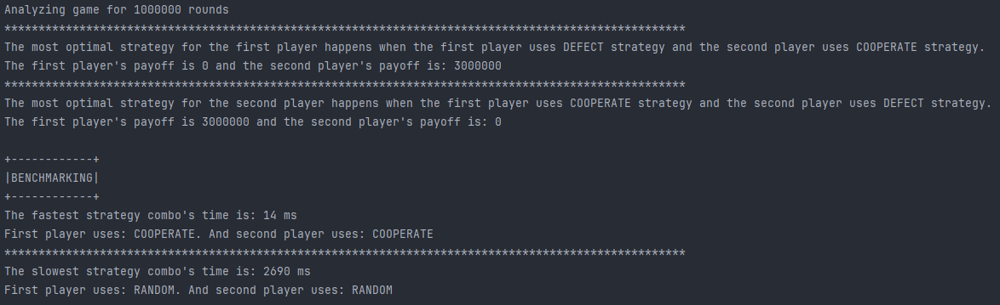

# Prisoner's Dilemma

## Introduction

The application implements the following well-known Prisoner's Dilemma strategies:

1. **TIP_FOR_TAT**: a player starts by cooperating, then repeats an opponent's last move;
2. **COOPERATE**: a player always cooperates no matter what;
3. **DEFECT**: a player always defects no matter what;
4. **GRIM_TRIGGER**: a player cooperates until the opponent betrays once. After that betrayal, the player switches to betraying in all future rounds;
5. **RANDOM**: a player randomly chooses between cooperation and betrayal.

The following payoff rules are used in the application:

1. If player A stays silent and player B stays silent then A's payoff = 1 and B's payoff = 1;
2. If payer A betrays and player B betrays then A's payoff = 2 and B's payoff = 2;
3. If player A stays silent and player B betrays then A's payoff = 3 and B's payoff = 0;
4. If player A betrays and player B stays silent then A's payoff = 0 and B's payoff = 3.

The application uses implemented strategies to run them against each other.
Each pair of strategies is running during 1_000_000 iterations to determine the most optimal and the fastest strategies pair.

## Output Example

## Best Strategy

Based on the results, the optimal strategy for a player is when the player always betrays his opponent and the opponent always tries to cooperate with the player.
In this case, the player receives no punishment while the opponent receives light sentence every time.

## Benchmarking

### Explanation

It worth noting that benchmarking isn't a straightforward task, and it will not work properly if we just use System.currentTimeMillis() before and after `game.play(firstStrategy, secondStrategy)` method call.
The reason for that is that Java uses Garbage Collector to optimize memory usage. And Garbage Collector could be called at any time by a JVM. Random GC cleanups pause application executions and therefore benchmarking might produce not accurate results.

To avoid memory cleanups we can use so-called No-Op (or Epsilon) Garbage Collector that:

> [Epsilon] ... handles memory allocation but does not implement any actual memory reclamation mechanism.
> Once the available Java heap is exhausted, the JVM will shut down.

The detailed description is available [here](https://openjdk.org/jeps/318).

In order to enable Java No-Op Garbage Collector, we need to pass the following VM arguments:

`-XX:+UnlockExperimentalVMOptions -XX:+UseEpsilonGC`

After that, the No-Op GC will be enabled and the benchmarking will return accurate results.

### Results analysis

Based on the output example provided above, the fastest strategies pair is when both players use **COOPERATE** strategy.
But it's not the real truth. If you try to run the application multiple times, you'll see that the faster strategies pair might be different on every execution, but it never includes **RANDOM** strategy.
The reason for that is that **TIP_FOR_TAT**, **COOPERATE**, **DEFECT** and **GRIM_TRIGGER** strategies does not consume much CPU resources, and it takes less CPU resources to handle one of those strategies.
On the other hand, **RANDOM** strategy requires generating new boolean value on every move that consumes more memory and CPU resources.
We can also see that **RANDOM** & **RANDOM** strategy pair is almost 200 times slower that the fastest strategy pair (**COOPERATE** & **COOPERATE**);
